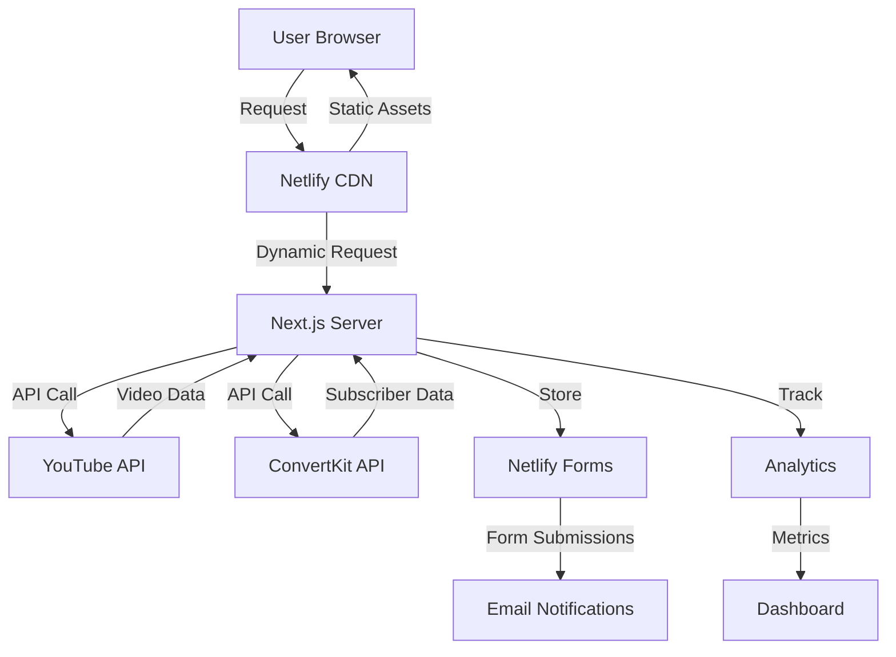

# Design Document

## Overview

The Betirement Website is a Next.js 14 application optimized for deployment on Netlify, designed to deliver high-performance, SEO-optimized content while providing a seamless user experience across all devices. The architecture prioritizes static generation where possible, with strategic use of server components and API routes for dynamic functionality.

### Technology Stack

- **Framework**: Next.js 14.2+ (App Router)
- **Language**: TypeScript 5.3+
- **Styling**: Tailwind CSS 3.4+ with custom design system
- **Deployment**: Netlify with automatic GitHub deployments
- **Email**: ConvertKit API integration
- **Analytics**: Vercel Analytics + Plausible Analytics
- **Forms**: Netlify Forms for contact/lead capture
- **Video**: YouTube Data API v3 integration
- **Image Optimization**: Next.js Image component with Netlify CDN

### Design Principles

1. **Performance First**: Target 90+ Lighthouse scores on all metrics
2. **SEO Optimized**: Proper metadata, schema markup, and semantic HTML
3. **Progressive Enhancement**: Core functionality works without JavaScript
4. **Mobile First**: Design and develop for mobile, enhance for desktop
5. **Accessibility**: WCAG 2.1 AA compliance minimum
6. **Scalability**: Architecture supports future CMS and e-commerce integration

## Architecture

### Application Structure

```
betirement-website/
├── src/
│   ├── app/                    # Next.js App Router pages
│   │   ├── (marketing)/        # Marketing pages group
│   │   │   ├── page.tsx        # Home page
│   │   │   ├── about/
│   │   │   ├── start-here/
│   │   │   └── speaking/
│   │   ├── content/            # Content hub
│   │   │   ├── videos/
│   │   │   ├── blog/
│   │   │   └── resources/
│   │   ├── community/          # Community portal
│   │   ├── api/                # API routes
│   │   ├── layout.tsx          # Root layout
│   │   └── globals.css         # Global styles
│   ├── components/             # React components
│   │   ├── ui/                 # Reusable UI components
│   │   ├── sections/           # Page sections
│   │   ├── forms/              # Form components
│   │   └── layout/             # Layout components
│   ├── lib/                    # Utility functions
│   │   ├── youtube.ts          # YouTube API client
│   │   ├── convertkit.ts       # ConvertKit API client
│   │   ├── analytics.ts        # Analytics utilities
│   │   └── utils.ts            # General utilities
│   ├── types/                  # TypeScript type definitions
│   ├── config/                 # Configuration files
│   │   ├── site.ts             # Site metadata
│   │   └── navigation.ts       # Navigation structure
│   └── data/                   # Static data (JSON/MD)
│       ├── blog/               # Blog posts (Markdown)
│       ├── resources/          # Resource metadata
│       └── testimonials/       # Testimonials data
├── public/                     # Static assets
│   ├── images/
│   ├── downloads/              # PDFs, guides
│   └── favicon/
├── netlify/
│   └── functions/              # Netlify serverless functions
└── content/                    # Content files (future CMS)
```


### Rendering Strategy

The application uses a hybrid rendering approach optimized for Netlify:

1. **Static Generation (SSG)**: Default for most pages
   - Home, About, Start Here, Speaking pages
   - Blog posts and resource pages
   - Generated at build time, served from CDN

2. **Incremental Static Regeneration (ISR)**: For semi-dynamic content
   - Video library (revalidate every 1 hour)
   - Blog index (revalidate every 30 minutes)
   - Allows fresh content without full rebuilds

3. **Server Components**: For dynamic data fetching
   - YouTube video integration
   - Analytics data display
   - User-specific content (future)

4. **Client Components**: For interactivity
   - Forms and modals
   - Interactive calculators
   - Video players
   - Navigation menus

### Data Flow Architecture



## Components and Interfaces

### Core Component Library

#### Layout Components

**Header Component**
- Sticky navigation with logo and menu items
- Mobile hamburger menu with slide-out drawer
- CTA button prominently displayed
- Search functionality (future)

**Footer Component**
- Multi-column layout with links
- Social media icons
- Newsletter signup form
- Legal links (Privacy, Terms, Disclaimer)

**Navigation Component**
- Desktop: Horizontal menu with dropdowns
- Mobile: Hamburger menu with accordion
- Active state indicators
- Smooth scroll to sections

#### UI Components

**Button Component**
```typescript
interface ButtonProps {
  variant: 'primary' | 'secondary' | 'outline' | 'ghost';
  size: 'sm' | 'md' | 'lg';
  children: React.ReactNode;
  onClick?: () => void;
  href?: string;
  disabled?: boolean;
  loading?: boolean;
}
```

**Card Component**
```typescript
interface CardProps {
  title: string;
  description?: string;
  image?: string;
  href?: string;
  badge?: string;
  footer?: React.ReactNode;
}
```

**Modal Component**
```typescript
interface ModalProps {
  isOpen: boolean;
  onClose: () => void;
  title: string;
  children: React.ReactNode;
  size?: 'sm' | 'md' | 'lg' | 'xl';
}
```


#### Form Components

**EmailCaptureForm Component**
```typescript
interface EmailCaptureFormProps {
  variant: 'inline' | 'modal' | 'slide-in';
  leadMagnet?: string;
  tags?: string[];
  onSuccess?: () => void;
}
```

**ContactForm Component**
```typescript
interface ContactFormProps {
  type: 'general' | 'speaking' | 'media';
  onSubmit: (data: FormData) => Promise<void>;
}
```

**QuizForm Component**
```typescript
interface QuizFormProps {
  questions: QuizQuestion[];
  onComplete: (results: QuizResults) => void;
}

interface QuizQuestion {
  id: string;
  question: string;
  options: string[];
  type: 'single' | 'multiple';
}
```

#### Content Components

**VideoCard Component**
```typescript
interface VideoCardProps {
  id: string;
  title: string;
  thumbnail: string;
  duration: string;
  category: VideoCategory;
  publishedAt: string;
  viewCount?: number;
}
```

**BlogCard Component**
```typescript
interface BlogCardProps {
  slug: string;
  title: string;
  excerpt: string;
  coverImage: string;
  author: string;
  publishedAt: string;
  readingTime: number;
  tags: string[];
}
```

**ResourceCard Component**
```typescript
interface ResourceCardProps {
  title: string;
  description: string;
  type: 'pdf' | 'calculator' | 'template';
  downloadUrl?: string;
  requiresEmail: boolean;
  difficulty: 'beginner' | 'intermediate' | 'advanced';
}
```

### Page-Specific Components

#### Home Page Sections

**HeroSection**
- Full-width background video or image
- Animated headline with typing effect
- Trust indicators (age, status, credentials)
- Dual CTAs with distinct styling
- Scroll indicator

**SocialProofBar**
- Real-time subscriber count from YouTube API
- Total video views counter
- Community member count
- Animated number transitions

**ValuePropositionGrid**
- Four-column grid (responsive to 2x2 on mobile)
- Icon + headline + description for each value
- Hover effects with subtle animations
- Links to relevant sections

**FeaturedContent**
- Featured video with custom thumbnail
- Latest blog post preview
- Product spotlight card
- Upcoming event banner


#### About Page Sections

**InteractiveTimeline**
- Vertical timeline with scroll-triggered animations
- Four key milestones with images and descriptions
- Progress indicator showing current position
- Responsive design (horizontal on mobile)

**VideoIntroduction**
- Embedded YouTube player with custom controls
- Transcript toggle
- Download PDF button below video
- Related content suggestions

**CredibilitySection**
- Grid layout with credential cards
- Professional background highlights
- Media appearance logos
- Certifications with verification links

#### Content Hub Sections

**VideoLibrary**
- Grid layout with filtering sidebar
- Category filter buttons
- Search bar with debounced input
- Pagination or infinite scroll
- Sort options (date, views, duration)

**BlogList**
- Card-based layout with featured post
- Category and tag filters
- Search functionality
- Pagination with SEO-friendly URLs

**ResourcesCenter**
- Categorized resource cards
- Filter by type and difficulty
- Email gate for premium resources
- Download tracking

## Data Models

### Video Model

```typescript
interface Video {
  id: string;
  youtubeId: string;
  title: string;
  description: string;
  thumbnail: {
    default: string;
    medium: string;
    high: string;
  };
  publishedAt: string;
  duration: string;
  category: VideoCategory;
  tags: string[];
  viewCount: number;
  likeCount: number;
  transcript?: string;
}

type VideoCategory = 
  | 'bitcoin-fundamentals'
  | 'retirement-planning'
  | 'investment-strategies'
  | 'market-analysis'
  | 'success-stories'
  | 'book-club';
```

### Blog Post Model

```typescript
interface BlogPost {
  slug: string;
  title: string;
  excerpt: string;
  content: string; // Markdown or MDX
  coverImage: string;
  author: {
    name: string;
    avatar: string;
    bio: string;
  };
  publishedAt: string;
  updatedAt?: string;
  readingTime: number;
  tags: string[];
  category: string;
  seo: {
    title: string;
    description: string;
    keywords: string[];
    ogImage: string;
  };
  featured: boolean;
}
```

### Resource Model

```typescript
interface Resource {
  id: string;
  title: string;
  description: string;
  type: 'pdf' | 'calculator' | 'template' | 'checklist';
  category: string;
  difficulty: 'beginner' | 'intermediate' | 'advanced';
  downloadUrl?: string;
  requiresEmail: boolean;
  fileSize?: string;
  pageCount?: number;
  thumbnail: string;
  tags: string[];
  downloadCount: number;
}
```


### Form Submission Model

```typescript
interface FormSubmission {
  id: string;
  type: 'email-capture' | 'contact' | 'speaking' | 'quiz';
  data: Record<string, any>;
  email: string;
  source: string; // Page URL where form was submitted
  timestamp: string;
  tags: string[];
  convertKitSubscriberId?: string;
}
```

### Site Configuration Model

```typescript
interface SiteConfig {
  name: string;
  title: string;
  description: string;
  url: string;
  ogImage: string;
  links: {
    youtube: string;
    twitter: string;
    instagram: string;
    linkedin: string;
  };
  author: {
    name: string;
    email: string;
    bio: string;
  };
  navigation: NavigationItem[];
}

interface NavigationItem {
  label: string;
  href: string;
  children?: NavigationItem[];
}
```

## API Integration Design

### YouTube Data API Integration

**Purpose**: Fetch and display Michael's YouTube videos automatically

**Implementation**:
```typescript
// lib/youtube.ts
export class YouTubeClient {
  private apiKey: string;
  private channelId: string;

  async getChannelVideos(maxResults: number = 50): Promise<Video[]>
  async getVideoDetails(videoId: string): Promise<Video>
  async getPlaylistVideos(playlistId: string): Promise<Video[]>
  async searchVideos(query: string): Promise<Video[]>
}
```

**Caching Strategy**:
- Cache video data in memory for 1 hour
- Use ISR to regenerate video pages every hour
- Store video metadata in JSON files during build

**Rate Limiting**:
- YouTube API quota: 10,000 units/day
- Implement request batching
- Cache responses aggressively
- Fallback to cached data if quota exceeded

### ConvertKit API Integration

**Purpose**: Manage email subscribers and automation

**Implementation**:
```typescript
// lib/convertkit.ts
export class ConvertKitClient {
  private apiKey: string;
  private apiSecret: string;

  async addSubscriber(email: string, tags: string[]): Promise<Subscriber>
  async tagSubscriber(subscriberId: string, tagId: string): Promise<void>
  async getSubscriber(email: string): Promise<Subscriber | null>
  async unsubscribe(email: string): Promise<void>
}
```

**Form Flow**:
1. User submits email on website
2. Client-side validation
3. POST to `/api/subscribe` endpoint
4. Server validates and calls ConvertKit API
5. Add subscriber with appropriate tags
6. Return success/error to client
7. Show confirmation message

**Tags Strategy**:
- Source tags: `website-home`, `website-blog`, `lead-magnet-xyz`
- Interest tags: `bitcoin`, `retirement`, `investing`
- Engagement tags: `video-viewer`, `blog-reader`, `resource-downloader`


### Netlify Forms Integration

**Purpose**: Handle contact forms and lead capture without backend

**Implementation**:
- Use Netlify Forms for form handling
- Add `netlify` attribute to forms
- Configure spam protection with honeypot
- Set up email notifications
- Store submissions in Netlify dashboard

**Form Types**:
1. Email capture forms (multiple locations)
2. Contact form (general inquiries)
3. Speaking request form
4. Quiz submission form

### Analytics Integration

**Vercel Analytics**:
- Automatic page view tracking
- Web Vitals monitoring
- Zero configuration required

**Plausible Analytics**:
- Privacy-focused alternative
- Custom event tracking
- Goal conversions
- No cookie banner required

**Custom Events to Track**:
- Email signups (by source)
- Video plays
- Resource downloads
- External link clicks
- Quiz completions
- Social shares

## Design System

### Color Palette

```typescript
// tailwind.config.ts colors
const colors = {
  bitcoin: {
    50: '#FFF7ED',
    100: '#FFEDD5',
    500: '#F7931A', // Primary Bitcoin Orange
    600: '#EA8600',
    700: '#C97100',
  },
  black: {
    DEFAULT: '#0D0D0D', // Rich Black
    light: '#1A1A1A',
  },
  success: {
    DEFAULT: '#27AE60',
    light: '#2ECC71',
  },
  trust: {
    DEFAULT: '#2E86DE',
    light: '#3498DB',
  },
  neutral: {
    50: '#F8F9FA',
    100: '#E9ECEF',
    500: '#6C757D',
    900: '#212529',
  },
};
```

### Typography Scale

```typescript
// Font configuration
const fonts = {
  heading: ['Inter', 'system-ui', 'sans-serif'],
  body: ['Open Sans', 'system-ui', 'sans-serif'],
};

const fontSize = {
  xs: ['0.75rem', { lineHeight: '1rem' }],
  sm: ['0.875rem', { lineHeight: '1.25rem' }],
  base: ['1rem', { lineHeight: '1.5rem' }],
  lg: ['1.125rem', { lineHeight: '1.75rem' }],
  xl: ['1.25rem', { lineHeight: '1.75rem' }],
  '2xl': ['1.5rem', { lineHeight: '2rem' }],
  '3xl': ['1.875rem', { lineHeight: '2.25rem' }],
  '4xl': ['2.25rem', { lineHeight: '2.5rem' }],
  '5xl': ['3rem', { lineHeight: '1' }],
  '6xl': ['3.75rem', { lineHeight: '1' }],
};
```

### Spacing System

Following Tailwind's default spacing scale (4px base unit):
- xs: 0.5rem (8px)
- sm: 0.75rem (12px)
- md: 1rem (16px)
- lg: 1.5rem (24px)
- xl: 2rem (32px)
- 2xl: 3rem (48px)
- 3xl: 4rem (64px)

### Component Styling Patterns

**Button Variants**:
```css
.btn-primary: Bitcoin orange background, white text, hover darken
.btn-secondary: Black background, white text, hover lighten
.btn-outline: Transparent background, border, hover fill
.btn-ghost: Transparent background, no border, hover subtle bg
```

**Card Styles**:
```css
.card: White background, subtle shadow, rounded corners
.card-hover: Lift effect on hover, shadow increase
.card-featured: Bitcoin orange accent border
```

**Input Styles**:
```css
.input: Border, rounded, focus ring (bitcoin orange)
.input-error: Red border, error message below
.input-success: Green border, success icon
```


## Responsive Design Strategy

### Breakpoints

```typescript
const breakpoints = {
  sm: '640px',   // Mobile landscape
  md: '768px',   // Tablet
  lg: '1024px',  // Desktop
  xl: '1280px',  // Large desktop
  '2xl': '1536px', // Extra large
};
```

### Mobile-First Approach

**Navigation**:
- Mobile: Hamburger menu with slide-out drawer
- Desktop: Horizontal menu with dropdowns

**Grid Layouts**:
- Mobile: Single column
- Tablet: 2 columns
- Desktop: 3-4 columns

**Typography**:
- Mobile: Smaller font sizes, tighter line height
- Desktop: Larger font sizes, more generous spacing

**Images**:
- Mobile: Optimized smaller images
- Desktop: Higher resolution images
- Use Next.js Image component with responsive sizes

### Touch Targets

- Minimum 44x44px for all interactive elements
- Adequate spacing between clickable items
- Larger buttons on mobile devices

## Performance Optimization

### Image Optimization

**Strategy**:
1. Use Next.js Image component for automatic optimization
2. Serve WebP format with fallbacks
3. Implement lazy loading for below-fold images
4. Use appropriate sizing with srcset
5. Compress images before upload (target: <200KB)

**Implementation**:
```typescript
<Image
  src="/images/hero.jpg"
  alt="Description"
  width={1200}
  height={600}
  priority={false} // true for above-fold
  quality={85}
  placeholder="blur"
/>
```

### Code Splitting

**Automatic**:
- Next.js automatically splits code by route
- Each page loads only required JavaScript

**Manual**:
```typescript
// Dynamic imports for heavy components
const VideoPlayer = dynamic(() => import('@/components/VideoPlayer'), {
  loading: () => <Skeleton />,
  ssr: false,
});
```

### Font Optimization

**Strategy**:
1. Use next/font for automatic font optimization
2. Subset fonts to include only needed characters
3. Preload critical fonts
4. Use font-display: swap

**Implementation**:
```typescript
import { Inter, Open_Sans } from 'next/font/google';

const inter = Inter({
  subsets: ['latin'],
  display: 'swap',
  variable: '--font-inter',
});
```

### Caching Strategy

**Static Assets**:
- Cache-Control: public, max-age=31536000, immutable
- Served from Netlify CDN

**API Responses**:
- YouTube data: Cache for 1 hour
- Blog posts: Cache until revalidation
- Forms: No caching

**Service Worker** (Future):
- Cache static assets
- Offline fallback page
- Background sync for forms


## SEO Strategy

### Metadata Implementation

**Page-Level Metadata**:
```typescript
// app/page.tsx
export const metadata: Metadata = {
  title: 'Betirement - Your Bridge to Bitcoin-Powered Freedom',
  description: 'Real experience. Proven strategies. Your path to early retirement with Bitcoin.',
  keywords: ['bitcoin retirement', 'early retirement', 'bitcoin investing'],
  openGraph: {
    title: 'Betirement - Bitcoin-Powered Early Retirement',
    description: 'Learn how to retire early with Bitcoin from someone who did it.',
    images: ['/images/og-image.jpg'],
    type: 'website',
  },
  twitter: {
    card: 'summary_large_image',
    title: 'Betirement - Bitcoin-Powered Early Retirement',
    description: 'Real experience. Proven strategies.',
    images: ['/images/twitter-card.jpg'],
  },
};
```

### Schema Markup

**Organization Schema**:
```json
{
  "@context": "https://schema.org",
  "@type": "Organization",
  "name": "Betirement",
  "url": "https://betirement.com",
  "logo": "https://betirement.com/logo.png",
  "sameAs": [
    "https://youtube.com/@betirement",
    "https://twitter.com/betirement"
  ]
}
```

**Person Schema** (About Page):
```json
{
  "@context": "https://schema.org",
  "@type": "Person",
  "name": "Michael",
  "jobTitle": "Bitcoin Retirement Strategist",
  "description": "Retired at 51 using Bitcoin strategies"
}
```

**Article Schema** (Blog Posts):
```json
{
  "@context": "https://schema.org",
  "@type": "Article",
  "headline": "Article Title",
  "author": {
    "@type": "Person",
    "name": "Michael"
  },
  "datePublished": "2024-01-01",
  "image": "article-image.jpg"
}
```

**Video Schema** (Video Pages):
```json
{
  "@context": "https://schema.org",
  "@type": "VideoObject",
  "name": "Video Title",
  "description": "Video description",
  "thumbnailUrl": "thumbnail.jpg",
  "uploadDate": "2024-01-01",
  "duration": "PT10M30S"
}
```

### URL Structure

**Clean, SEO-Friendly URLs**:
- Home: `/`
- About: `/about`
- Videos: `/content/videos` or `/content/videos/[category]`
- Single Video: `/content/videos/[slug]`
- Blog: `/content/blog` or `/content/blog/[category]`
- Single Post: `/content/blog/[slug]`
- Resources: `/content/resources`
- Community: `/community`
- Start Here: `/start-here`
- Speaking: `/speaking`

### Sitemap Generation

**Implementation**:
```typescript
// app/sitemap.ts
export default async function sitemap(): Promise<MetadataRoute.Sitemap> {
  const posts = await getBlogPosts();
  const videos = await getVideos();
  
  return [
    { url: 'https://betirement.com', priority: 1 },
    { url: 'https://betirement.com/about', priority: 0.8 },
    ...posts.map(post => ({
      url: `https://betirement.com/content/blog/${post.slug}`,
      lastModified: post.updatedAt,
      priority: 0.6,
    })),
    ...videos.map(video => ({
      url: `https://betirement.com/content/videos/${video.id}`,
      lastModified: video.publishedAt,
      priority: 0.5,
    })),
  ];
}
```

### Robots.txt

```
User-agent: *
Allow: /
Disallow: /api/
Disallow: /admin/

Sitemap: https://betirement.com/sitemap.xml
```


## Error Handling

### Client-Side Error Handling

**Form Validation**:
```typescript
interface FormError {
  field: string;
  message: string;
}

// Validation patterns
const emailRegex = /^[^\s@]+@[^\s@]+\.[^\s@]+$/;
const phoneRegex = /^\+?[\d\s-()]+$/;

// Error display
- Inline errors below fields
- Summary errors at top of form
- Prevent submission until valid
```

**API Error Handling**:
```typescript
try {
  const response = await fetch('/api/subscribe', {
    method: 'POST',
    body: JSON.stringify({ email }),
  });
  
  if (!response.ok) {
    throw new Error('Subscription failed');
  }
  
  // Success handling
} catch (error) {
  // Show user-friendly error message
  toast.error('Something went wrong. Please try again.');
  // Log error for debugging
  console.error('Subscription error:', error);
}
```

### Server-Side Error Handling

**API Route Error Handling**:
```typescript
// app/api/subscribe/route.ts
export async function POST(request: Request) {
  try {
    const { email } = await request.json();
    
    // Validation
    if (!email || !emailRegex.test(email)) {
      return NextResponse.json(
        { error: 'Invalid email address' },
        { status: 400 }
      );
    }
    
    // Process subscription
    await convertKit.addSubscriber(email);
    
    return NextResponse.json({ success: true });
  } catch (error) {
    console.error('API Error:', error);
    return NextResponse.json(
      { error: 'Internal server error' },
      { status: 500 }
    );
  }
}
```

### Error Pages

**404 Not Found**:
```typescript
// app/not-found.tsx
export default function NotFound() {
  return (
    <div>
      <h1>Page Not Found</h1>
      <p>The page you're looking for doesn't exist.</p>
      <Link href="/">Return Home</Link>
    </div>
  );
}
```

**500 Server Error**:
```typescript
// app/error.tsx
export default function Error({
  error,
  reset,
}: {
  error: Error;
  reset: () => void;
}) {
  return (
    <div>
      <h1>Something went wrong</h1>
      <button onClick={reset}>Try again</button>
    </div>
  );
}
```

### Error Monitoring

**Strategy**:
- Log errors to console in development
- Use Sentry or similar in production (future)
- Track error rates in analytics
- Set up alerts for critical errors

## Testing Strategy

### Unit Testing

**Framework**: Jest + React Testing Library

**What to Test**:
- Utility functions (validation, formatting)
- Component rendering
- User interactions
- Form submissions
- API client functions

**Example**:
```typescript
// __tests__/components/Button.test.tsx
describe('Button', () => {
  it('renders with correct text', () => {
    render(<Button>Click me</Button>);
    expect(screen.getByText('Click me')).toBeInTheDocument();
  });
  
  it('calls onClick when clicked', () => {
    const handleClick = jest.fn();
    render(<Button onClick={handleClick}>Click</Button>);
    fireEvent.click(screen.getByText('Click'));
    expect(handleClick).toHaveBeenCalledTimes(1);
  });
});
```


### Integration Testing

**Framework**: Playwright or Cypress

**What to Test**:
- User flows (signup, navigation)
- Form submissions end-to-end
- Video playback
- Search functionality
- Mobile responsiveness

**Example Flow**:
```typescript
test('email signup flow', async ({ page }) => {
  await page.goto('/');
  await page.fill('[name="email"]', 'test@example.com');
  await page.click('button[type="submit"]');
  await expect(page.locator('.success-message')).toBeVisible();
});
```

### Performance Testing

**Tools**:
- Lighthouse CI in GitHub Actions
- WebPageTest for detailed analysis
- Core Web Vitals monitoring

**Thresholds**:
- Performance score: 90+
- Accessibility score: 95+
- Best Practices score: 95+
- SEO score: 95+

### Manual Testing Checklist

**Pre-Launch**:
- [ ] Test all forms on mobile and desktop
- [ ] Verify email integrations work
- [ ] Check all links (internal and external)
- [ ] Test video playback
- [ ] Verify analytics tracking
- [ ] Test on multiple browsers (Chrome, Safari, Firefox)
- [ ] Test on multiple devices (iOS, Android)
- [ ] Verify SSL certificate
- [ ] Check page load times
- [ ] Test 404 and error pages

## Security Considerations

### Input Validation

**Client-Side**:
- Validate all form inputs before submission
- Sanitize user input to prevent XSS
- Use TypeScript for type safety

**Server-Side**:
- Re-validate all inputs on server
- Use parameterized queries (when DB added)
- Implement rate limiting on API routes

### API Security

**Rate Limiting**:
```typescript
// lib/rate-limit.ts
import { Ratelimit } from '@upstash/ratelimit';

const ratelimit = new Ratelimit({
  redis: Redis.fromEnv(),
  limiter: Ratelimit.slidingWindow(10, '10 s'),
});

export async function checkRateLimit(identifier: string) {
  const { success } = await ratelimit.limit(identifier);
  return success;
}
```

**API Key Protection**:
- Store API keys in environment variables
- Never expose keys in client-side code
- Use Netlify environment variables
- Rotate keys periodically

### Content Security Policy

```typescript
// next.config.js
const securityHeaders = [
  {
    key: 'X-DNS-Prefetch-Control',
    value: 'on'
  },
  {
    key: 'X-Frame-Options',
    value: 'SAMEORIGIN'
  },
  {
    key: 'X-Content-Type-Options',
    value: 'nosniff'
  },
  {
    key: 'Referrer-Policy',
    value: 'origin-when-cross-origin'
  },
];
```

### HTTPS Enforcement

- Netlify provides automatic HTTPS
- Redirect all HTTP to HTTPS
- Use HSTS headers

### Spam Protection

**Forms**:
- Honeypot fields (hidden from users)
- reCAPTCHA v3 (invisible)
- Rate limiting on submissions
- Email validation

**Comments** (Future):
- Moderation queue
- Akismet integration
- User reputation system


## Deployment Strategy

### Netlify Configuration

**netlify.toml**:
```toml
[build]
  command = "npm run build"
  publish = ".next"

[[plugins]]
  package = "@netlify/plugin-nextjs"

[build.environment]
  NODE_VERSION = "20"

[[redirects]]
  from = "/api/*"
  to = "/.netlify/functions/:splat"
  status = 200

[[headers]]
  for = "/*"
  [headers.values]
    X-Frame-Options = "SAMEORIGIN"
    X-Content-Type-Options = "nosniff"
    Referrer-Policy = "origin-when-cross-origin"

[[headers]]
  for = "/images/*"
  [headers.values]
    Cache-Control = "public, max-age=31536000, immutable"
```

### Environment Variables

**Required Variables**:
```bash
# YouTube API
YOUTUBE_API_KEY=your_youtube_api_key
YOUTUBE_CHANNEL_ID=your_channel_id

# ConvertKit
CONVERTKIT_API_KEY=your_convertkit_api_key
CONVERTKIT_API_SECRET=your_convertkit_secret

# Analytics
NEXT_PUBLIC_PLAUSIBLE_DOMAIN=betirement.com

# Site Configuration
NEXT_PUBLIC_SITE_URL=https://betirement.com
```

### CI/CD Pipeline

**GitHub Actions Workflow**:
```yaml
name: Deploy to Netlify

on:
  push:
    branches: [main]
  pull_request:
    branches: [main]

jobs:
  build:
    runs-on: ubuntu-latest
    steps:
      - uses: actions/checkout@v3
      - uses: actions/setup-node@v3
        with:
          node-version: '20'
      - run: npm ci
      - run: npm run lint
      - run: npm run build
      - run: npm run test
```

**Deployment Flow**:
1. Push to GitHub main branch
2. Netlify detects change
3. Runs build command
4. Deploys to production
5. Invalidates CDN cache
6. Sends deployment notification

### Preview Deployments

- Automatic preview for all pull requests
- Unique URL for each preview
- Test changes before merging
- Share with stakeholders for review

### Rollback Strategy

- Netlify keeps deployment history
- One-click rollback to previous version
- Atomic deployments (all or nothing)
- Zero downtime deployments

## Accessibility (A11y)

### WCAG 2.1 AA Compliance

**Color Contrast**:
- Text: Minimum 4.5:1 ratio
- Large text: Minimum 3:1 ratio
- Interactive elements: Clear focus states

**Keyboard Navigation**:
- All interactive elements accessible via keyboard
- Logical tab order
- Skip to main content link
- Visible focus indicators

**Screen Reader Support**:
- Semantic HTML elements
- ARIA labels where needed
- Alt text for all images
- Proper heading hierarchy

**Implementation Examples**:
```typescript
// Accessible button
<button
  aria-label="Subscribe to newsletter"
  aria-describedby="newsletter-description"
>
  Subscribe
</button>

// Accessible form
<form aria-labelledby="form-title">
  <h2 id="form-title">Contact Us</h2>
  <label htmlFor="email">Email</label>
  <input
    id="email"
    type="email"
    aria-required="true"
    aria-invalid={hasError}
    aria-describedby={hasError ? "email-error" : undefined}
  />
  {hasError && (
    <span id="email-error" role="alert">
      Please enter a valid email
    </span>
  )}
</form>

// Accessible navigation
<nav aria-label="Main navigation">
  <ul>
    <li><a href="/" aria-current="page">Home</a></li>
    <li><a href="/about">About</a></li>
  </ul>
</nav>
```

### Testing Tools

- axe DevTools browser extension
- Lighthouse accessibility audit
- NVDA/JAWS screen reader testing
- Keyboard-only navigation testing


## Future Enhancements

### Phase 2: CMS Integration

**Sanity.io Setup**:
- Schema definitions for blog posts, resources, testimonials
- Studio customization for content editors
- Real-time preview integration
- Image CDN with automatic optimization
- Webhook triggers for rebuilds

**Benefits**:
- Non-technical content management
- Structured content with validation
- Version history and drafts
- Collaborative editing
- API-first architecture

### Phase 3: E-commerce Integration

**Stripe Integration**:
- Product catalog management
- Checkout session creation
- Webhook handling for order fulfillment
- Customer portal for subscriptions
- Invoice generation

**Digital Product Delivery**:
- Secure download links with expiration
- Course platform integration
- Member area with gated content
- Progress tracking
- Certificate generation

**Physical Product Fulfillment**:
- Print-on-demand integration (Printful)
- Inventory management
- Shipping calculation
- Order tracking
- Customer notifications

### Phase 4: Community Features

**Member Portal**:
- User authentication (NextAuth.js)
- Profile management
- Discussion forums
- Private messaging
- Activity feeds

**Gamification**:
- Points and badges system
- Leaderboards
- Challenges and quests
- Achievement unlocks
- Referral rewards

### Phase 5: Advanced Features

**Personalization**:
- Content recommendations based on behavior
- Dynamic homepage for returning visitors
- Personalized email campaigns
- A/B testing framework
- User segmentation

**Mobile App**:
- React Native companion app
- Push notifications
- Offline content access
- Native video player
- Biometric authentication

**AI Features**:
- Chatbot for common questions
- Content summarization
- Personalized learning paths
- Automated content tagging
- Sentiment analysis on feedback

## Maintenance and Monitoring

### Regular Maintenance Tasks

**Weekly**:
- Review analytics data
- Check for broken links
- Monitor error logs
- Review form submissions
- Update content as needed

**Monthly**:
- Security updates (dependencies)
- Performance audit
- SEO ranking check
- Backup verification
- Content calendar review

**Quarterly**:
- Comprehensive security audit
- User feedback analysis
- Feature prioritization
- Design refresh evaluation
- Competitor analysis

### Monitoring Setup

**Uptime Monitoring**:
- Pingdom or UptimeRobot
- Alert on downtime
- Response time tracking
- SSL certificate expiration alerts

**Performance Monitoring**:
- Vercel Analytics for Core Web Vitals
- Lighthouse CI in GitHub Actions
- Real User Monitoring (RUM)
- Error tracking with Sentry (future)

**Analytics Review**:
- Weekly traffic reports
- Conversion funnel analysis
- User behavior patterns
- Content performance metrics
- Goal completion rates

### Backup Strategy

**Automated Backups**:
- GitHub repository (code)
- Netlify deployment history
- Environment variables documented
- Content exports (when CMS added)

**Recovery Plan**:
- Documented rollback procedure
- Contact list for emergencies
- Service provider credentials secured
- Regular recovery testing

## Documentation

### Developer Documentation

**README.md**:
- Project overview
- Setup instructions
- Environment variables
- Development workflow
- Deployment process

**Component Documentation**:
- Storybook for component library (future)
- Props documentation with TypeScript
- Usage examples
- Accessibility notes

**API Documentation**:
- Endpoint descriptions
- Request/response examples
- Authentication requirements
- Rate limiting details

### Content Guidelines

**Writing Style**:
- Conversational yet authoritative
- Personal but professional
- Clear and concise
- Action-oriented
- Empowering tone

**SEO Guidelines**:
- Target keyword in title
- Meta description 150-160 characters
- Header hierarchy (H1 → H2 → H3)
- Internal linking strategy
- Image alt text requirements

**Brand Guidelines**:
- Logo usage rules
- Color palette specifications
- Typography standards
- Voice and tone examples
- Do's and don'ts

## Success Metrics

### Key Performance Indicators

**Traffic Metrics**:
- Unique visitors per month
- Page views per session
- Average session duration
- Bounce rate
- Traffic sources

**Engagement Metrics**:
- Email signup conversion rate
- Video view completion rate
- Blog post read time
- Resource download rate
- Social shares

**Technical Metrics**:
- Page load time (target: <2s)
- Core Web Vitals (all green)
- Lighthouse scores (90+)
- Error rate (<0.1%)
- Uptime (99.9%+)

**Business Metrics** (Future):
- Product conversion rate
- Average order value
- Customer lifetime value
- Churn rate
- Net Promoter Score

### Optimization Targets

**Month 1-3**:
- 1,000+ email subscribers
- 10,000+ monthly visitors
- 90+ Lighthouse performance score
- 5% email signup conversion rate

**Month 4-6**:
- 5,000+ email subscribers
- 25,000+ monthly visitors
- Featured in 3+ publications
- 10% email signup conversion rate

**Month 7-12**:
- 15,000+ email subscribers
- 50,000+ monthly visitors
- First product launch
- Established community of 500+ active members

## Conclusion

This design document provides a comprehensive blueprint for building the Betirement website as a high-performance, SEO-optimized, and user-friendly platform. The architecture is designed to be scalable, maintainable, and ready for future enhancements while delivering immediate value through core features.

The focus on performance, accessibility, and user experience ensures that visitors will have a positive interaction with the brand, while the integration with ConvertKit and analytics tools provides the foundation for growing the email list and measuring success.

By following this design, the development team can build a professional website that establishes Michael as a trusted authority in the Bitcoin retirement space and creates a sustainable platform for content distribution, community building, and future revenue generation.
